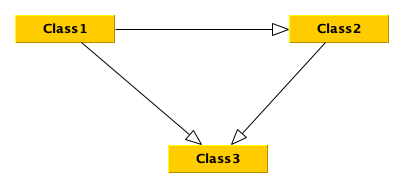

# GraphML-XMI Converter

This tool allows conversion between **Yed GraphML** and **StarUML XMI**, making it easier to work with UML class diagrams across different platforms.

## Features
- Converts **GraphML** files from Yed into **XMI** for StarUML.
- Converts **XMI** files from StarUML back into **GraphML** for Yed.
- Supports **class objects** and **associations** (relationships between classes).
- Ensures proper formatting for StarUML and Yed compatibility.

## Installation

### **1. Install Python**
Ensure you have **Python 3.x** installed. You can check your version by running:

```bash
python --version
```

If you don't have Python installed, download it from [Python.org](https://www.python.org/downloads/).

### **2. Download the Script**

Save the script `graphml_xmi_converter.py` in a directory of your choice.

### **3. Install Dependencies (if needed)**

This script uses the built-in `xml.etree.ElementTree` module, so no external dependencies are required.


## Usage

Run the script using the following command:

```bash
python graphml_xmi_converter.py <direction> <input_file> <output_file>
```

Where:
- `<direction>` is either:
  - `graphml2xmi` (to convert Yed GraphML → StarUML XMI)
  - `xmi2graphml` (to convert StarUML XMI → Yed GraphML)
- `<input_file>` is the path to your source file.
- `<output_file>` is the path where the converted file will be saved.


## Examples

### Convert **GraphML to XMI**:
If you have a UML class diagram saved as `diagram.graphml` from Yed and want to convert it to **StarUML XMI**, run:

```bash
python graphml_xmi_converter.py graphml2xmi diagram.graphml diagram.xmi
```

After conversion, import `diagram.xmi` in starUML to see the UML diagram.


> [!NOTE]
> You can import the XMI (XML Metadata Interchange) file into StarUML with the [XMI extension for StarUML](https://github.com/staruml/staruml-xmi).

### Convert **XMI to GraphML**:

If you have an XMI file exported from StarUML called `diagram.xmi` and want to convert it into a **Yed GraphML** format, run:

```bash
python graphml_xmi_converter.py xmi2graphml diagram.xmi diagram.graphml
```

After conversion, open `diagram.graphml` in Yed to see the UML diagram.




## Troubleshooting

### **1. The output file is blank or missing nodes/edges.**

- Ensure that your input file is correctly formatted (e.g., valid XMI from StarUML or GraphML from Yed).
- Double-check that the file paths are correct.
- If converting **XMI → GraphML**, make sure your XMI includes UML class and association definitions.

### **2. Command not recognized (Windows users)**

If running `python graphml_xmi_converter.py ...` gives an error, try:

```bash
python3 graphml_xmi_converter.py ...
```

### **3. Can't open the converted GraphML in Yed**

- Make sure the GraphML file contains `<node>` and `<edge>` elements by opening it in a text editor.
- If associations aren't appearing, confirm that your XMI file has `<ownedEnd>` elements correctly set.


## Additional Notes

- The script is designed for **UML Class Diagrams**.
- More complex UML elements (such as interfaces, generalization, or multiplicity constraints) are not currently handled.
- If your diagram has **many-to-many associations**, ensure your tools support them properly before converting.

For more information on the software used for class diagrams:

- [StarUML](https://staruml.io/)
- [yEd - Graph Editor](https://www.yworks.com/products/yed)


## License

This tool is provided under the **MIT License**. Feel free to modify and improve it!

For support or contributions, create an issue on the repository.

